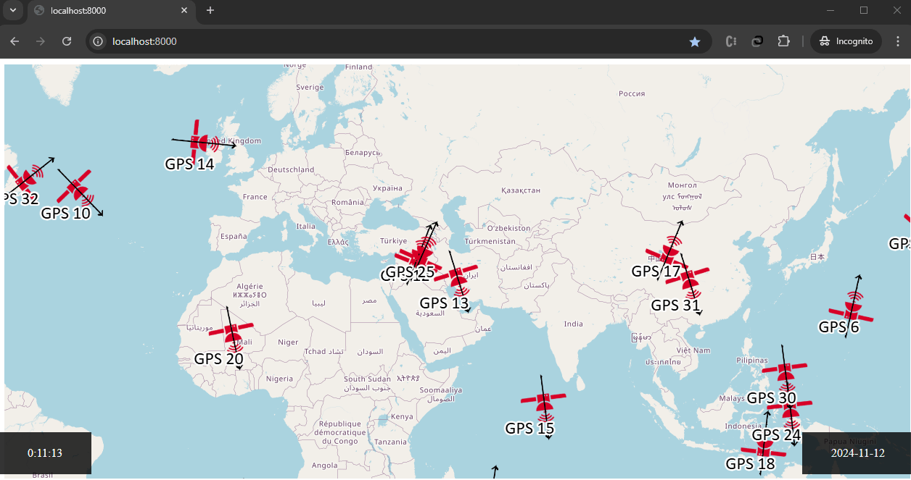
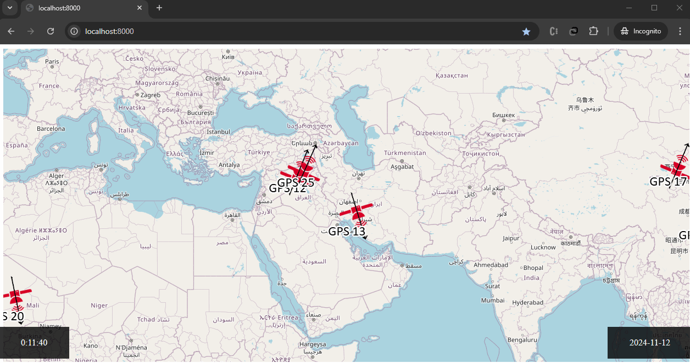

# Almanac - A Web App for GPS Skyplot and Satellite Mapping

## Project Overview

**Almanac** is a web-based map application developed for the **GNSS Course** as my project in **Winter 2018** at the **University of Isfahan** (where I studied my bachelor's). The app uses a **GPS almanac file** to generate a GPS skyplot and display satellite information, including PRN code, altitude, latitude, and longitude (in the WGS84 coordinate system). This project leverages various JavaScript libraries to handle map rendering, satellite data plotting, and UI functionality.

## About the Almanac

A **GPS almanac** file contains coarse orbital data for each GPS satellite, including orbital parameters and time information. This data is less precise than an ephemeris but can provide a general overview of satellite positions at any given time. The Almanac file is essential for determining satellite locations, which is then visualized on the web app's skyplot and satellite map.

## Libraries Used

The following libraries were used to build this application:

- **jQuery** (`^3.3.1`): For handling DOM manipulations and AJAX requests.
- **Launchy Modal Window** (`^0.9.2`): Provides modal windows for satellite information display.
- **Moment.js** (`^2.22.2`): Manages date and time functionalities.
- **myfs** (`^1.0.19`): Facilitates file reading for local almanac data.
- **OpenLayers (ol)** (`^5.3.0`): Renders the interactive web map.
- **Plotly** (`^1.0.6`) and **Plotly.js-dist** (`^1.42.5`): Used for visualizing satellite positions in a skyplot.
- **Read-Text-File** (`^1.1.0`): Reads almanac files as text files.
- **Statics** (`^0.1.0`): Manages static assets and file paths.

## Running the Project

Use the following scripts to run and build the project:

- **Start the project**:

  ```bash
  npm run start
  ```

  This command uses Parcel to serve `index.html` on a local development server.

- **Build the project**:
  ```bash
  npm run build
  ```
  Creates a production build of the app, optimized and ready for deployment.

## Project Demo

| Feature                   | GIF Demo                                                                               |
| ------------------------- | -------------------------------------------------------------------------------------- |
| **Satellite Information** |  – Shows PRN, Altitude, Lat, Lon in WGS84. |
| **GPS Skyplot**           |  – Generates a skyplot from a selected point.          |

_Note: HDOP, VDOP, and PDOP metrics are currently a TODO._
